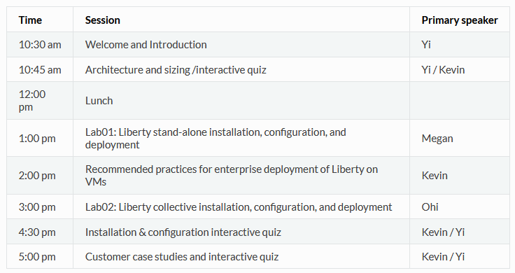

# Modernizing Applications with WebSphere Liberty on VMs Level 4

<!--

-->

**Saturday, October 19, 2024** 

Time: 10:30 am - 6:00 pm 

This is a 1 day technical learning journey.  

[Slack channel: #tx-weekend-liberty-on-vms-2024](https://ibm.enterprise.slack.com/archives/C07GGS01Q93)

[Download Course Description and Agenda:](https://ibm.box.com/s/spiyymafnvmmo0932eyk1agbxxetmovq) 
  
  - Refer to the **"Hands-on Labs"** menu item from the left-navigation section to access the lab guides and lab environment. 
   

  
<h3 style="color:black">Proposed Agenda</h3>

<h3 style="color:black">Presentation Material</h3>

[Material shared with attendees](https://ibm.box.com/v/Liberty-L4-Share)

<h3 style="color:black">Hands-on Labs</h3>

  - [Access the hands-on lab guides and lab environments](./day1.md)  
  
  
<!-- 
  - [How to access the lab environment](./lab-env.md) 
-->

