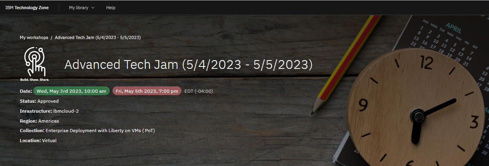
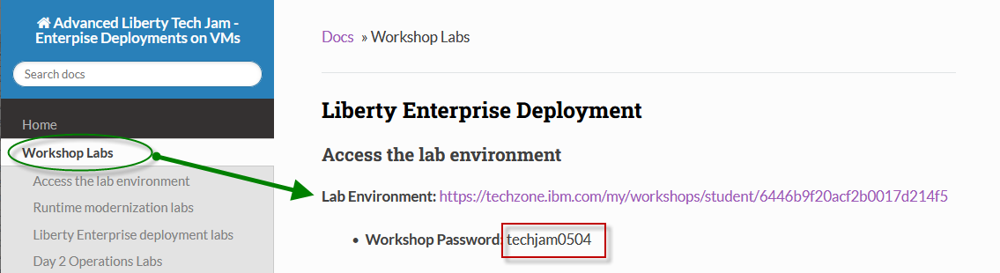
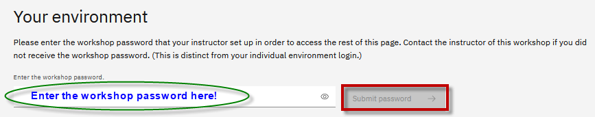
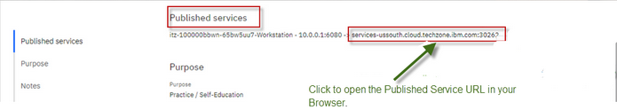
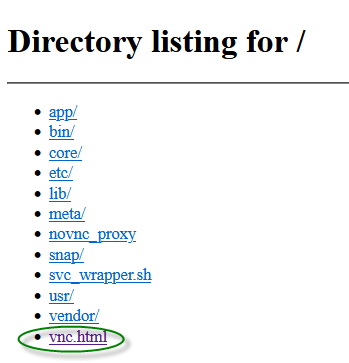
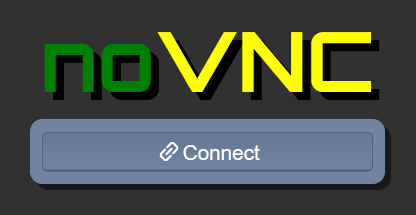
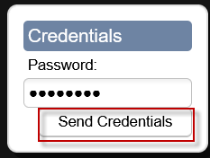

<h2 style="color:black">Accessing lab environment</h2>

  

1. Go to the Attendee Lab URL from the **Workshop Labs** menu item, 

    From the **Workshop Labs** menu item, select the Lab Environment URL for the specific lab(s) you want to run

    **NOTE:** Your workshop password is NOT the password illustrated in the example below. 
	
	
	**NOTE:** Refer to the **Workshop Labs** page for your specific workshop password. 
	
	

     
 
2. Enter the `workshop password:` and click the `Submit password` button

    

     

3. Click the `Published Services` URL to your environment. 

   
	

     

    **Note:** The **Published Service** provides direct access to the VM environment that is used for all of the labs in the workshop. 

     
	
4. Select `vnc.html` from the directory listing page. 	

    
	
5. Click `Connect` on the **noVNC connection** page

    
	
     

6. Enter the **noVNC password** as `passw0rd`   (That is a numeric zero in passw0rd)

    
	
     
     
7. Follow the lab guide for instructions  

    **Note: **Each lab guide includes the information for acessing the VM, how to login to the VM, login credentials, etc.  

  
  